# 📊 DataAnalyzer

> Automatic Exploratory Data Analysis (EDA) for CSV & Excel datasets using MATLAB.

DataAnalyzer is a MATLAB App Designer application that automatically detects column data types and generates appropriate visualizations. Simply load a dataset, choose a column (or all columns), optionally provide a normal range, and let the application perform the analysis.

---

## ✨ Features

- 📂 Import CSV and Excel files
- 🧠 Automatic data type detection
- 📈 Numeric plots
  - Histogram
  - Box Plot
- 📊 Categorical plots
  - Bar Chart
  - Pie Chart
- 📏 Optional normal range input
- 💡 Percentage of values outside the specified range
- 🖥️ Simple MATLAB GUI

---

# Screenshots

## Main Interface

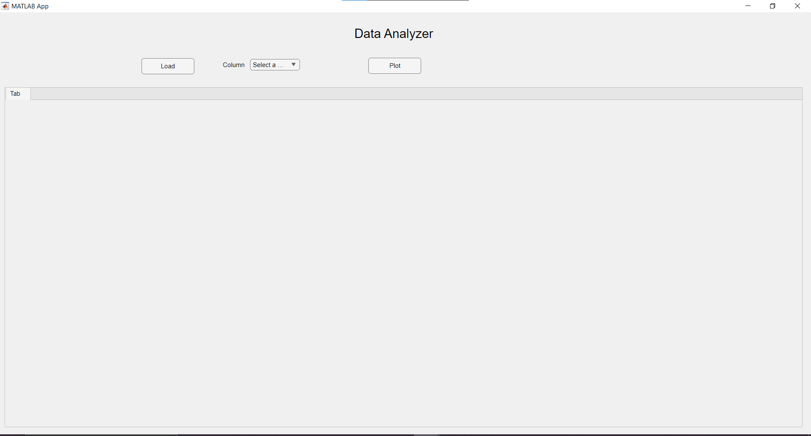

---

## Loading Dataset

<table>
<tr>
<td width="55%">
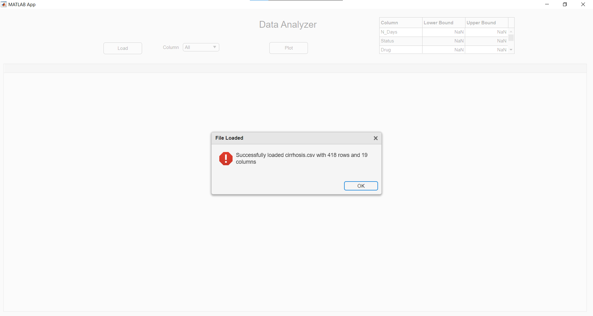
</td>
<td>

Load any CSV or Excel file. Once loaded, the application automatically reads the table and prepares it for analysis.

</td>
</tr>
</table>

---

## Column Selection

<table>
<tr>
<td width="55%">
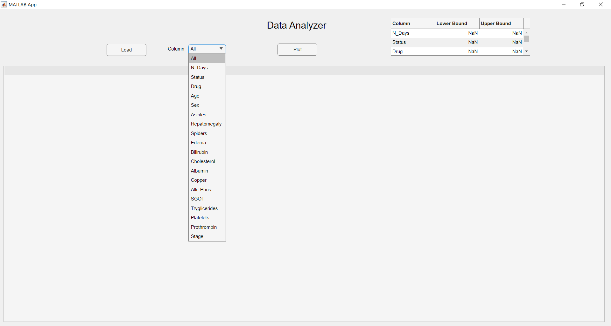
</td>
<td>

Choose a specific column or select **All** to analyze the entire dataset.

</td>
</tr>
</table>

---

## Example Analysis

<table>
<tr>
<td width="55%">
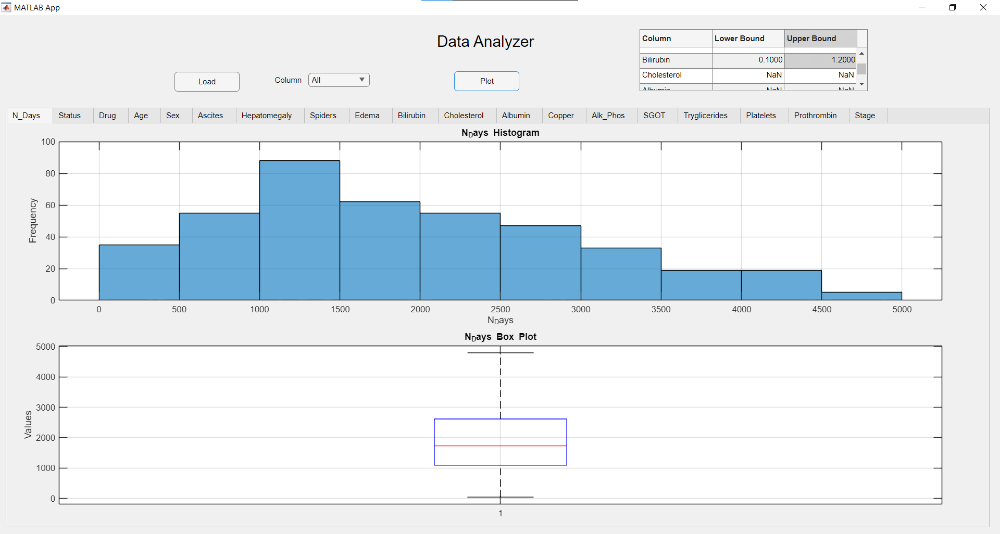
</td>
<td>

Example of automatic visualization with optional normal range analysis.

</td>
</tr>
</table>

---

## Another Numeric Example

<table>
<tr>
<td width="55%">
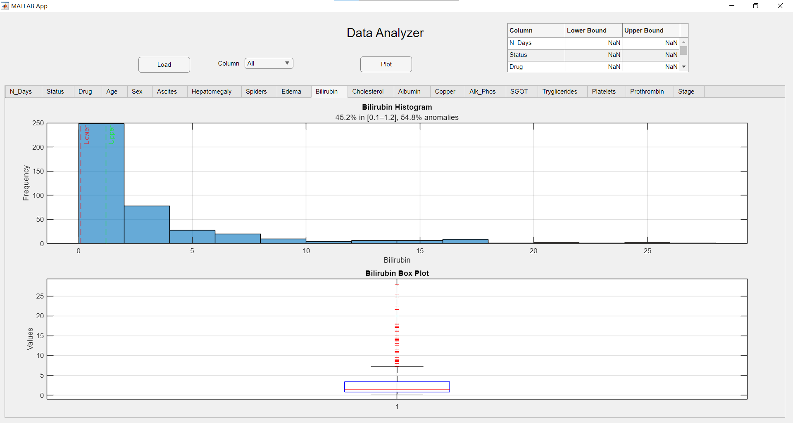
</td>
<td>

DataAnalyzer automatically selects suitable plots for numeric variables.

</td>
</tr>
</table>

---

## Individual Column Analysis

<table>
<tr>
<td width="55%">
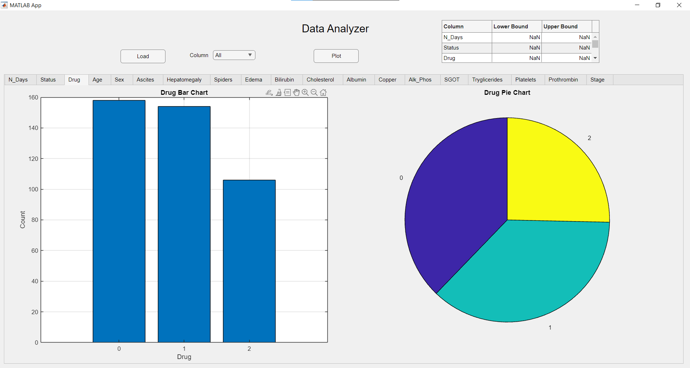
</td>
<td>

Analyze individual columns independently with customized normal ranges.

</td>
</tr>
</table>

---

# Generalization

The application works across different datasets without modification.

<table>
<tr>
<td align="center">

### Dataset Example 1

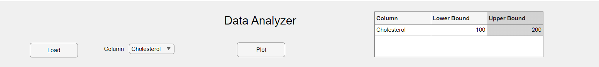

</td>

<td align="center">

### Dataset Example 2

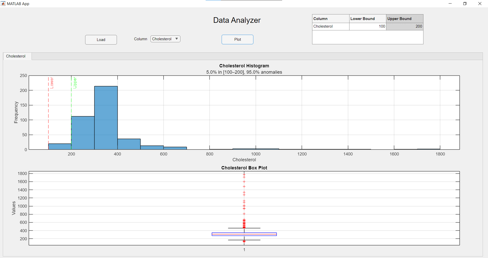

</td>

</tr>

<tr>

<td align="center">

### Dataset Example 3

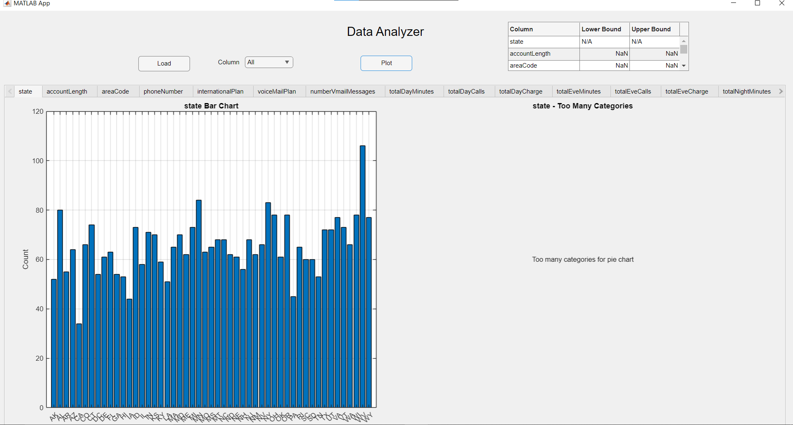

</td>

<td align="center">

### Additional Example

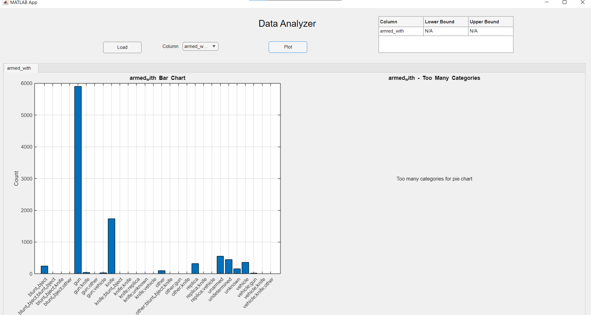

</td>

</tr>
</table>

---

## Final Result

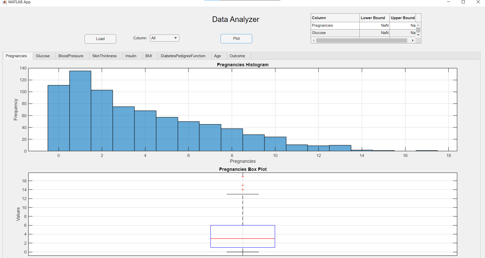

The application successfully performs automated exploratory data analysis on multiple datasets, demonstrating that it is general-purpose rather than dataset-specific.

---

# Built With

- MATLAB
- MATLAB App Designer
- MATLAB Tables
- MATLAB Plotting Functions

---

# License

Developed as a mini-project for **EEE 4416 – Simulation Lab** at the **Islamic University of Technology (IUT)**.

---

# Author

**Shahriar Fahim**

Electrical & Electronics Engineering (EEE)  
Islamic University of Technology (IUT)
